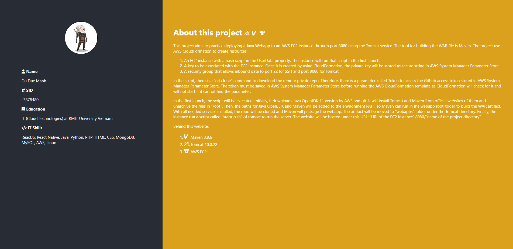

  
RMIT University Vietnam

  
Course: COSC2767 Systems Deployment and Operations

  
Semester: 2022B

  
Assessment: Assignment 1

  
Author: Du Duc Manh

  
ID: 3878480

  
Created  date: 12/07/2022

  
Last modified: 24/07/2022

  
Acknowledgement: AWS, AWS Java OpenJDK 11, Maven 3.8.6, Tomcat 10.0.22, fontawesome, font-mfizz-2.4.1.

<h1>About this project</h1>

    This project aims to practice deploying a Java Webapp to an AWS EC2 instance through port 8080 using the Tomcat service.
    The tool for building the WAR file is Maven. The project use AWS CloudFormation to create resources:

<ul>
    <li>
        An EC2 instance with a bash script in the UserData property. The instance will run that script in the first launch.
    </li>
    <li>
        A key to be associated with the EC2 instance. Since it is created by using CloudFormation, the private key will be stored
        as secure string in AWS System Manager Parameter Store.
    </li>
    <li>
        A security group that allows inbound data to port 22 for SSH and port 8080 for Tomcat.
    </li>
</ul>

    In the script, there is a "git clone" command to download the remote private repo. Therefore, there is a parameter called Token
    to access the Github access token stored in AWS System Manager Parameter Store. The token must be saved in AWS System Manager
    Parameter Store before running the AWS CloudFormation template as CloudFormation will check for it and will not start if it cannot
    find the parameter.

    In the first launch, the script will be executed. Initially, it downloads Java OpenJDK 11 version by AWS and git. It will
    install Tomcat and Maven from official websites of them and unarchive the files in "/opt". Then, the paths for Java OpenJDK
    and Maven will be added to the environment PATH so Maven can run in the webapp root folder to build the WAR artifact. With all
    needed services installed, the repo will be cloned and Maven will package the webapp. The artifact will be moved to "webapps" folder
    under the Tomcat directory. Finally, the instance run a script called "startup.sh" of tomcat to run the server. The website will
    be hosted under this URL: "URI of the EC2 Instance":8080/"name of the project directory"

    Behind this website:

<ul>
    <li>Maven 3.8.6</li>
    <li>Tomcat 10.0.22</li>
    <li>AWS EC2</li>
</ul>

<h1>Image of the website</h1>

